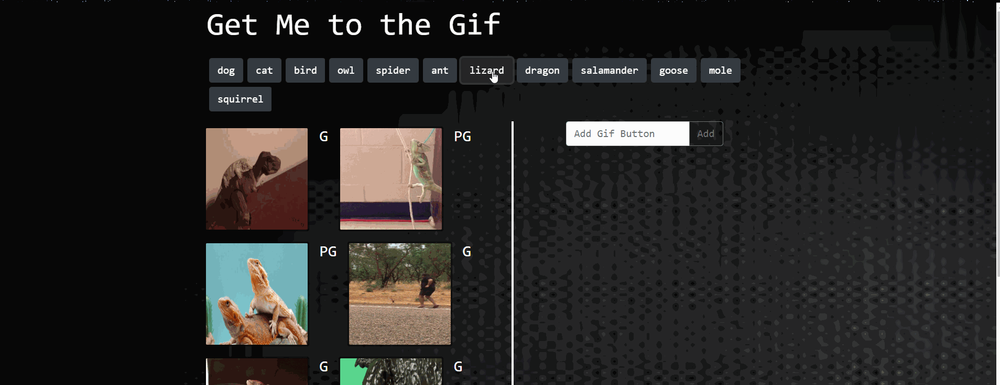
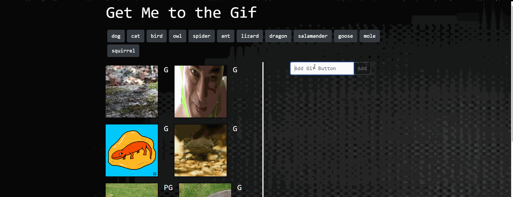
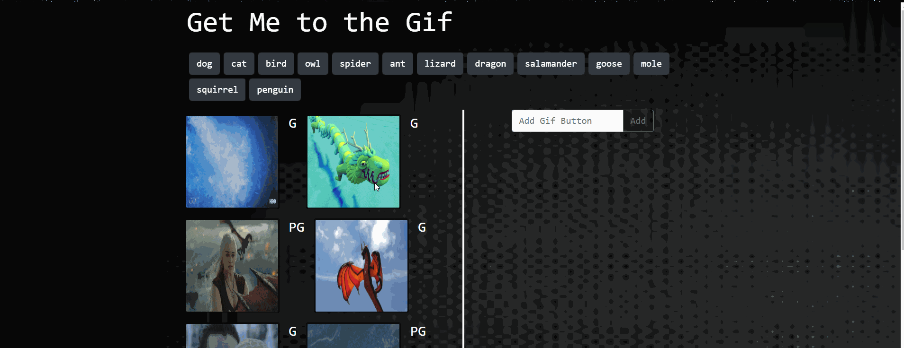

# Giphy Stash

### *Search giphy api with ease*
* This application will help you find fun gifs with ease 

## Local Usage
* Clone this repo to your computer
* open from the index.html file 
* Enjoy!

## Technologies: 
* [Javascript](https://www.javascript.com/) - The scripting language used to manipulate the DOM. 
* [JQuery](https://jquery.com/) - jQuery is a fast (arguable), small, and feature-rich JavaScript library.
* [HTML5](https://developer.mozilla.org/en-US/docs/Web/Guide/HTML/HTML5) - Mark up language used for structuring pages. 
* [BootStrap](https://getbootstrap.com/) - popular framework for building responsive websites
* [CSS](https://developer.mozilla.org/en-US/docs/Web/CSS) -is a stylesheet language used to describe the presentation of a document written in HTML or XML
* [Giphy API](https://developers.giphy.com/) - GIPHY SDK helps you integrate the world's largest GIF library. 

##Links : 
* Repo: [Git hub Repo](https://github.com/lmd808/giphy_Game).
* Deployed: [GitHub Pages](https://lmd808.github.io/Trivia_Game/).

## HomePage and Quick Site Demo:  

## Challenges: 
* My biggest challenge on this project was resisinc the images to make them look nice 

## Creator: 
Laura DiTommaso
